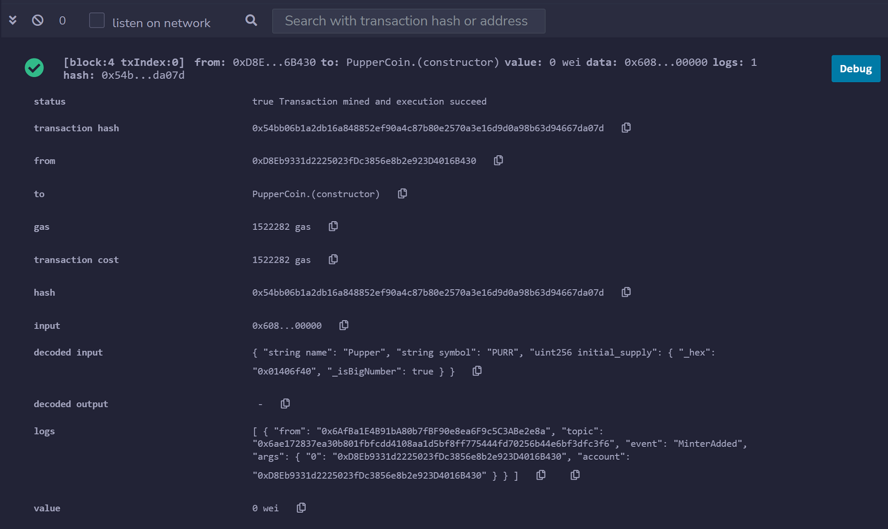
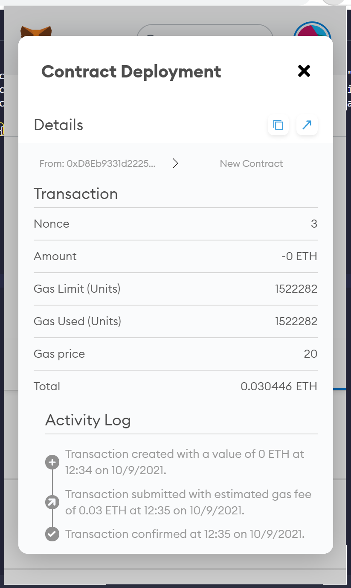
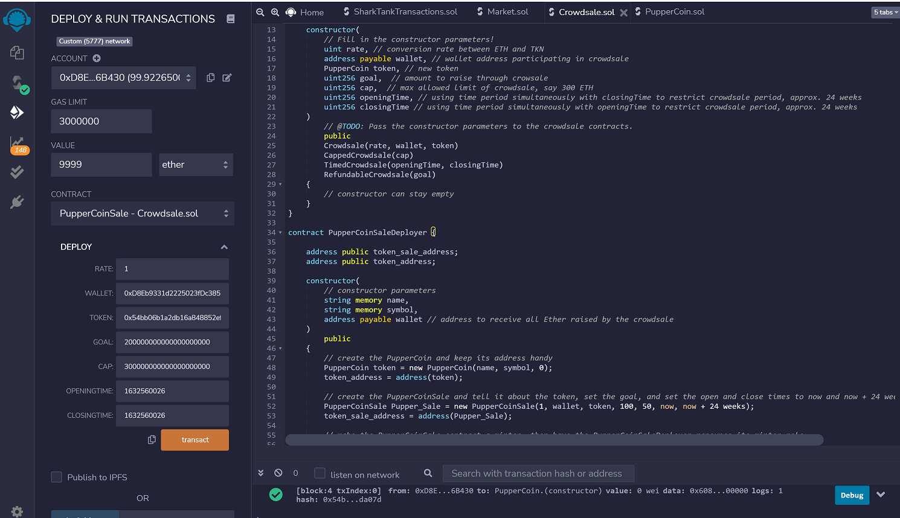
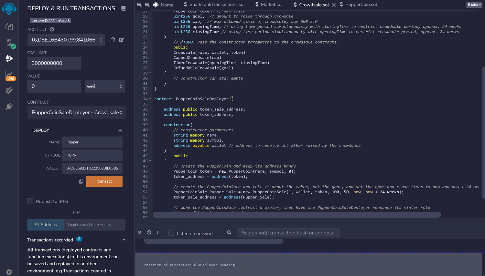

# Unit 21: You sure can attract a crowd!

1) Compiling PupperCoin.sol: This solidity contract creates custom token - PUPR

   

2) Deploying PupperCoin contract

   

3) Pupper coin (PUPR) is created and added to metamask wallet

   
   

4) Compiling CrowdSale.sol - This implements logic for crowdsale - 2 contracts 1.) PupperCoinSale & 2.) PupperCoinSaleDeployer

   

5) Deploying PupperCoinSaleDeployer contract

   

6) Deploying PupperCoinSale contract

   