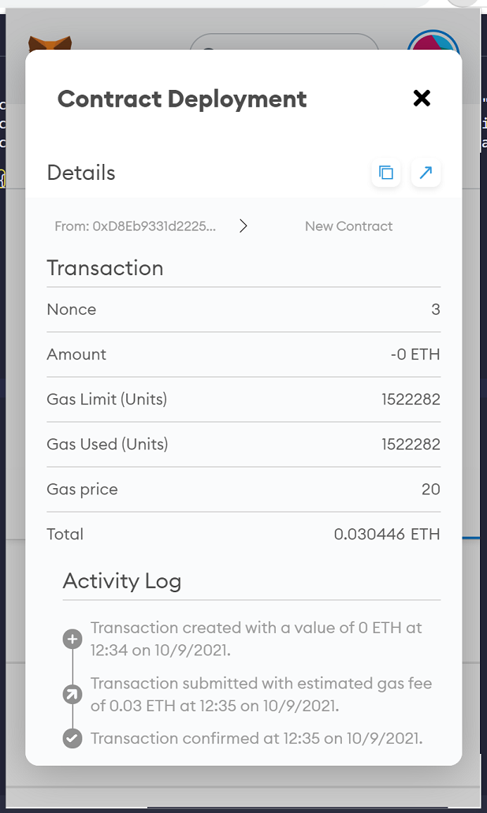

# Unit 21: You sure can attract a crowd!

1) Compiling PupperCoin.sol: This solidity contract creates custom token - PUPR
   

2) Deploy PupperCoin contract  
   

3) Pupper coin (PUPR) created and added to metamask wallet
   
   

4) Compile CrowdSale.sol - implements core logic for crowdsale - consists of two contracts (a) PupperCoinSale and (b) PupperCoinSaleDeployer  
   

5) Deploy PupperCoinSaleDeployer contract
   

6) Deploy PupperCoinSale contract
   